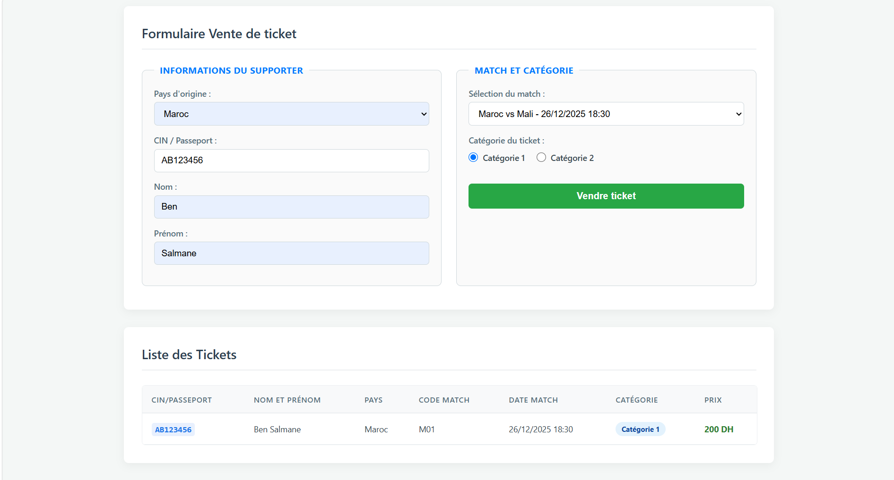

# Match Ticket Sales System (CAN 2025 Edition) 🎫

An advanced, interactive web-based ticketing system designed to process and manage stadium ticket sales dynamically. This project demonstrates strong core JavaScript logic, asynchronous data operations, and automated document printing.

## 🛠️ Key Features
- **Asynchronous Data Fetching:** Utilizes native `async/await` and the `fetch` API to load and parse real-time event matches dynamically from a localized `matchs.json` file.
- **Strict Data Validation & Regex:** Implements complex client-side validation, including custom Regular Expressions (`/^[A-Z]{1,2}\d{5,6}$/`) to filter and validate Moroccan identity cards (CIN) and passports.
- **Dynamic Data Rendering:** Manages real-time state mutations across arrays to compute categorised pricing models (Category 1 auto-multiplier) and instantly renders rows inside responsive tables using DOM node manipulation.
- **Automated Window Printing:** Dynamically spins up a new isolated browser window instance (`window.open()`), generates an inline, styled HTML receipt template on-the-fly, and invokes native OS print controls (`window.print()`).

## 🚀 Technologies Used
- **Logic & Control:** Asynchronous JavaScript (ES6+, Fetch API, Promises)
- **Data Formats:** JSON (JavaScript Object Notation)
- **Structure & Layout:** HTML5 (utilizing grid/flexbox fieldset layouts) & Custom CSS3 with custom badges
- **Core Concepts:** Event listeners (`DOMContentLoaded`, `click`), Regular Expressions (Regex), window streams, and state management.

---

## 📸 Interface Preview
Preview of the secure validation forms and the automated window stream print output:

